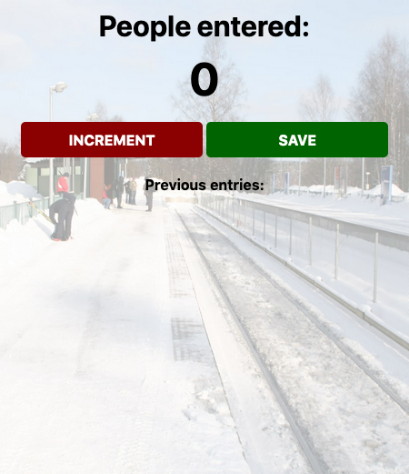

# Scrimba Frontend Career Path - (Module/App name here)

This is a solution to the [Scrimba Frontend Career Path - (Module 3 - Passenger Counter App)](https://scrimba.com/learn/frontend).

## Table of contents

- [Overview](#overview)
  - [The challenge](#the-challenge)
  - [Screenshot](#screenshot)
  - [Links](#links)
- [My process](#my-process)
  - [Built with](#built-with)
  - [What I learned](#what-i-learned)
  - [Continued development](#continued-development)
  - [Useful resources](#useful-resources)
- [Author](#author)
- [Acknowledgments](#acknowledgments)


## Overview

### The challenge

Users should be able to understand/code:

- script tag
- variables
- numbers
- strings
- console.log()
- functions
- the DOM
- getElementById()
- innerText
- textContent
- onclick

### Screenshot




### Links

- Solution URL: [Github](https://github.com/Rod-Barbosa/passengercounter-app)
- Live Site URL: [rodrigo-passengercounter-app.netlify.app/](https://rodrigo-passengercounter-app.netlify.app/)

## My process

### Built with

- Semantic HTML5 markup
- CSS custom properties
- JavaScript


### What I learned

This was a good review of basic concepts. The easy integration between onclick, and functions was nice to refresh my memory:

```html
<button id="increment-btn" onclick="increment()">INCREMENT</button>
<button id="save-btn" onclick="save()">SAVE</button>
```
Nice little trick to reset the count, and display it back to zero on the browser
```js
function save() {
    let countStr = count + " - "
    saveEl.textContent += countStr
    countEl.textContent = 0
    count = 0
}
```
The biggest nugget of wisdom was to use .textContent instead of .innerText to preserve the white spaces between the stored values
```js
function increment() {
    count += 1
    countEl.textContent = count
}
```

### Continued development

Just keep going on the career path and not be afraid to google things like ".innerTxt alternatives"

### Useful resources

- [Alternatives to innerText](https://developer.mozilla.org/pt-BR/docs/Web/API/Node/textContent) - The Mozilla Dev Network is proven time and time again to be a good friend for when I am in need

## Author

- Website - [Rodrigo Portfolio](https://www.gelatodigital.com)
- Frontend Mentor - [@Rod-Barbosa](https://www.frontendmentor.io/profile/Rod-Barbosa)
- Github - [@Rod-Barbosa](https://github.com/Rod-Barbosa)

## Acknowledgments

Thanks for the people on the dischord app, it does help to see people giving their best and going after it
